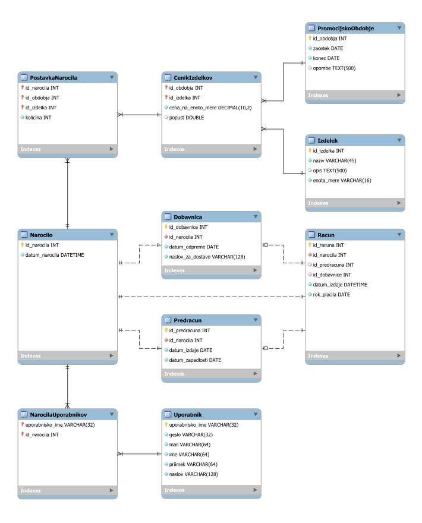

# Spletna trgovina

## Izdelek

Ta tabela je šifrant izdelkov.

### Opombe

Mogoče tu manjka kakšen atribut `kategorija`, ki bi omogočal filtriranje.

Za atribut `zaloga` se zdi, kot da je odveč. Informacijo o stanju zalog neka spletna
trgovina verjetno pridobi iz svojih skladiščnih podsistemov -
[*WMS (Warehouse Management System)*](https://en.wikipedia.org/wiki/Warehouse_management_system)

## Narocilo in PostavkaNarocila

Ti dve tabeli služita kot podpora za nakupovalno košarico.

Naročilo lahko izvede tudi "gost", saj tabela Uporabnik ni direktno vezana na
tabelo Narocilo.

## Dobavnica

To je neko potrdilo o odpremi pošiljke, hkrati pa lahko tu zabeležimo naslov
prejemnika. Naslov prejemnika ni vezan na uporabnika.

## Racun

Zadnja stopnja pri obdelavi naročila.

Pot od naročila do računa je na risbi modela predstavljena linearno, da se poudari
dejansko sosledje. Torej za neko naročilo bo najprej izdana dobavnica nato
pa še račun.

### Opombe

Morda atribut `id_dobavnice` ni obvezen. Recimo, da imamo tudi
fizično trgovino in stranka izbere osebni prevzem. Ampak potem bi bilo treba
na novo premisliti model, saj brez dobavnice izgubimo zvezo med računom in naročilom.

## Uporabnik in NarocilaUporabnika

Ti dve tabeli služita za obdelavo podatkov o kupcih.

Pogledamo lahko kdo je najbolj zvesta stranka glede na število nakupov in
na tej podlagi ponudimo popust. Ker hranimo naslov uporabnika, lahko
predlagamo naslov za dostavo.

### Opombe

V produkciji si morda ne bi želeli hraniti gesel v tekstovni obliki.
Morda manjka kakšen atribut `je_aktiven`, ki bi samo deaktiviral uporabnika
(in ne tudi pobrisal).
